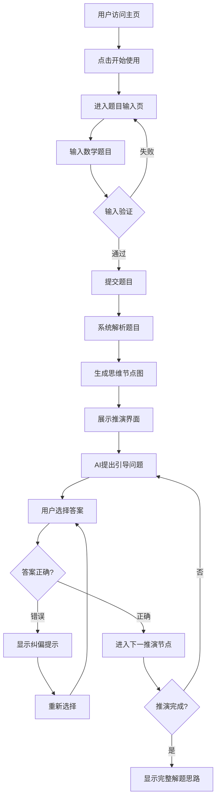

# 产品需求文档 (PRD)

## 1. 产品概述

数学思维训练助手是一款面向中学生的互动式数学学习工具，通过可视化思维节点图和苏格拉底式提问，帮助学生从根源上建立数学解题逻辑能力，减少对搜题软件的依赖。

## 2. 核心功能

### 2.1 用户角色
| 角色 | 使用方式 | 核心权限 |
|------|----------|----------|
| 学生 | 直接访问使用 | 输入题目、查看思维导图、参与推演、接收AI引导 |

### 2.2 功能模块
1. **主页**：欢迎界面、功能介绍、快速开始入口
2. **题目输入页**：题目输入框、题目类型选择、提交按钮
3. **思维推演页**：可视化思维节点图、推演分支展示、苏格拉底式提问面板、错误纠偏提示

### 2.3 页面详情
| 页面名称 | 模块名称 | 功能描述 |
|----------|----------|----------|
| 主页 | 欢迎区域 | 展示产品定位和核心价值，动画引导用户开始使用 |
| 主页 | 功能展示 | 卡片式展示三大核心功能：可视化思维导图、AI引导推演、错误纠偏 |
| 题目输入页 | 输入区域 | 支持文本输入数学题目，支持常见数学格式 |
| 题目输入页 | 提交控制 | 验证输入后提交，进入思维推演页面 |
| 思维推演页 | 节点图 | 基于ReactFlow展示思维节点和连接关系，支持拖拽和缩放 |
| 思维推演页 | 提问面板 | 显示AI生成的苏格拉底式问题，提供选项供用户选择 |
| 思维推演页 | 纠偏提示 | 用户选择错误路径时，显示温和的纠正提示和原因说明 |

## 3. 核心流程

## 4. 用户界面设计

### 4.1 设计风格
- **主题色调**：以温暖的蓝色为主色调，搭配柔和的绿色作为成功状态，橙色用于提示和纠偏
- **按钮风格**：圆角设计，带轻微阴影，悬停时有颜色加深和上浮动画
- **字体选择**：标题使用具有亲和力的圆体，正文使用清晰易读的无衬线字体
- **布局风格**：卡片式布局，顶部导航，内容区居中显示
- **图标风格**：使用简洁的线性图标，配合教育相关的图形元素

### 4.2 页面设计
| 页面名称 | 模块名称 | UI元素 |
|----------|----------|--------|
| 主页 | 欢迎区域 | 渐变背景，大标题动画入场，CTA按钮带脉冲效果 |
| 主页 | 功能展示 | 三列卡片布局，悬停放大效果，图标带动画 |
| 题目输入页 | 输入区域 | 大尺寸文本框，占位符提示，字符计数 |
| 思维推演页 | 节点图 | ReactFlow容器，节点带颜色编码，连线动画 |
| 思维推演页 | 提问面板 | 右侧固定面板，问题文本高亮，选项按钮 |

### 4.3 响应式设计
- 桌面端优先设计，支持平板和移动端自适应
- 思维节点图在移动端支持触控缩放和拖拽
- 提问面板在移动端转为底部弹出式
