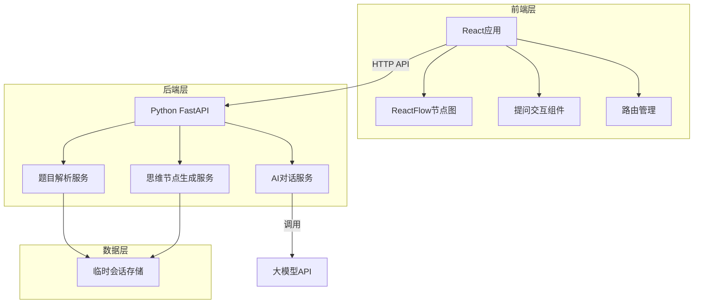
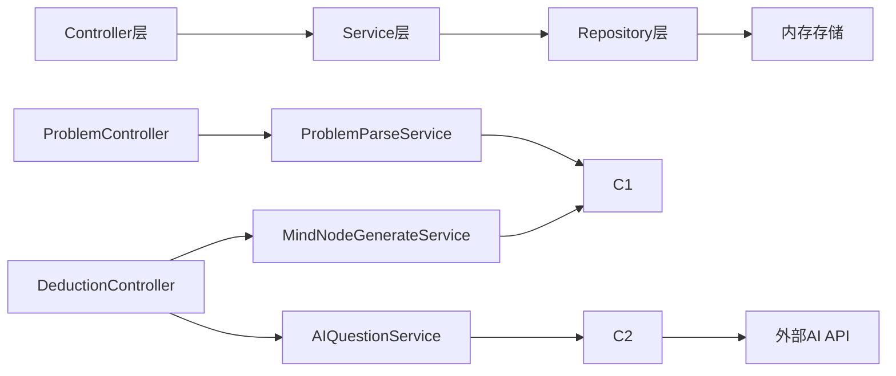
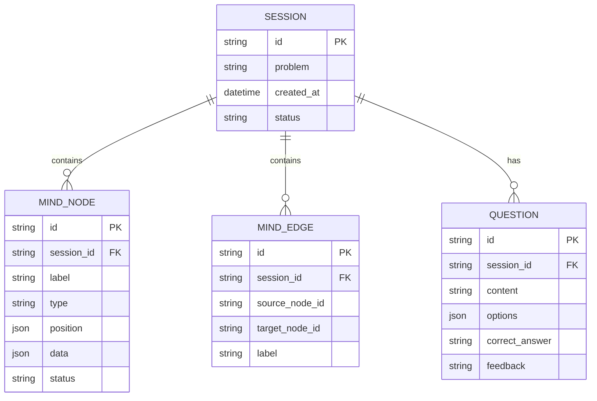

# 技术架构文档

## 1. 架构设计



## 2. 技术说明
- **前端**: React@18 + TypeScript + TailwindCSS + Vite
- **可视化**: ReactFlow@11 用于动态节点图展示
- **状态管理**: Zustand 用于前端状态管理
- **后端**: Python FastAPI 提供RESTful API
- **AI集成**: 通过API调用大语言模型能力
- **路由**: React Router DOM 用于前端路由

## 3. 路由定义
| 路由 | 用途 |
|------|------|
| / | 主页，产品介绍和快速开始 |
| /input | 题目输入页面 |
| /deduction | 思维推演页面，包含节点图和提问面板 |

## 4. API定义

```typescript
// 题目提交接口
interface SubmitProblemRequest {
  problem: string;
  problemType?: string;
}

interface SubmitProblemResponse {
  sessionId: string;
  initialNodes: MindNode[];
  initialEdges: MindEdge[];
}

// 思维节点数据结构
interface MindNode {
  id: string;
  label: string;
  type: 'condition' | 'inference' | 'conclusion' | 'question';
  position: { x: number; y: number };
  data: {
    content: string;
    status: 'pending' | 'active' | 'completed' | 'error';
  };
}

interface MindEdge {
  id: string;
  source: string;
  target: string;
  label?: string;
  animated?: boolean;
}

// 提问交互接口
interface QuestionRequest {
  sessionId: string;
  userAnswer: string;
  currentNodeId: string;
}

interface QuestionResponse {
  isCorrect: boolean;
  feedback?: string;
  nextNodes?: MindNode[];
  nextEdges?: MindEdge[];
  nextQuestion?: string;
  options?: string[];
}
```

## 5. 服务架构图



## 6. 数据模型

### 6.1 数据模型定义



### 6.2 数据定义
- 会话数据存储在内存中，支持多用户并发
- 每个会话包含独立的节点图和问题序列
- 会话超时自动清理（默认30分钟）
